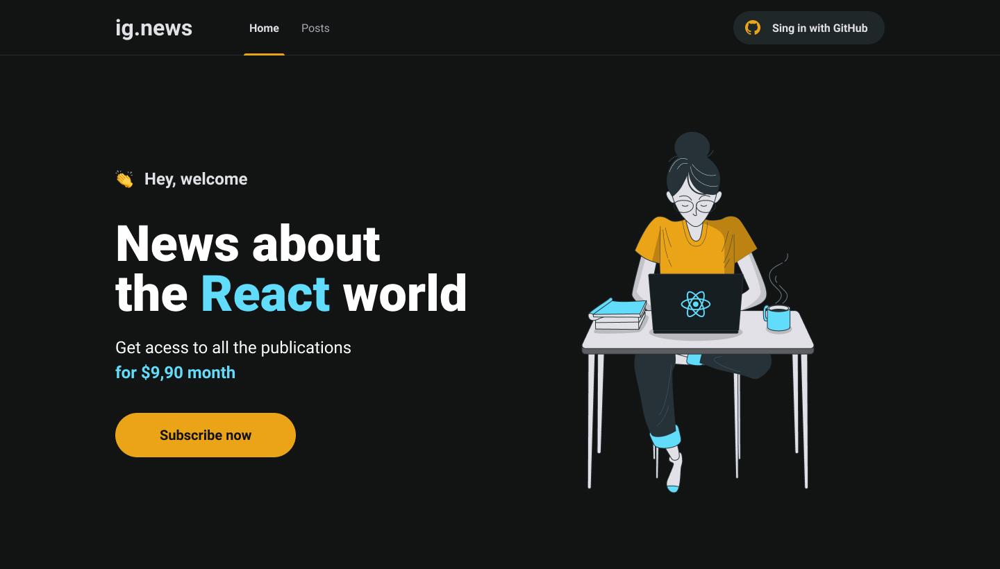

# Ig.news

Ignews is a subscription application, which consume content in texts (which in this case are posts) coming from a CMS.

Project developed in chapter 3 of rocketseat's ignite reactjs

## ⚙ Technologies & Services

- NextJS
- TypeScript
- CSS Modules
- SASS
- Stripe
- FaunaDB
- Prismic CMS
- NextAuth (Github authentication)

## 🚀 How to run locally

- clone this repository
- run `yarn` or `npm install` for to install depenndencies
- run `yarn stripe` or `npm run stripe` for to listen webhooks from Stripe
- run `yarn dev` or `npm run dev` for run the project in `http://localhost:3000`
